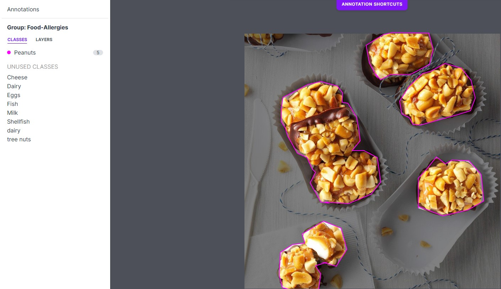
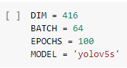
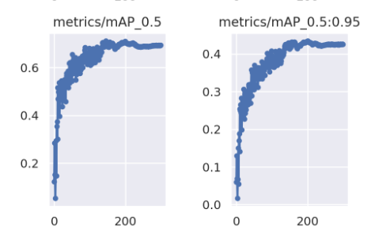
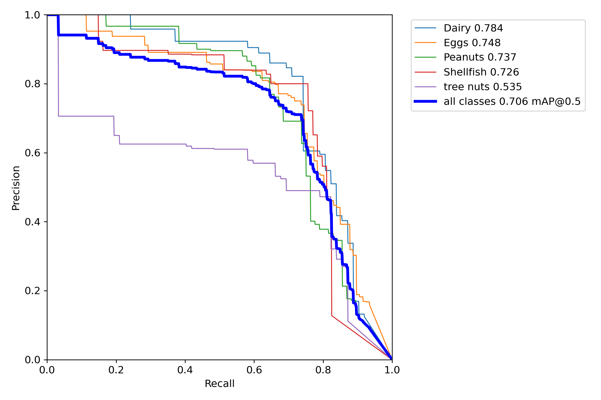
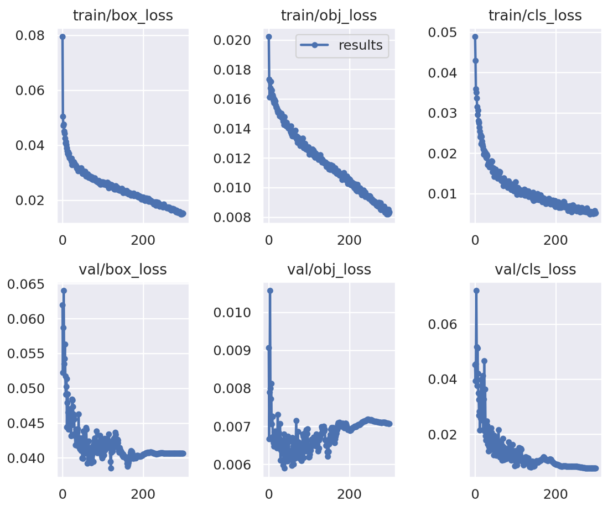
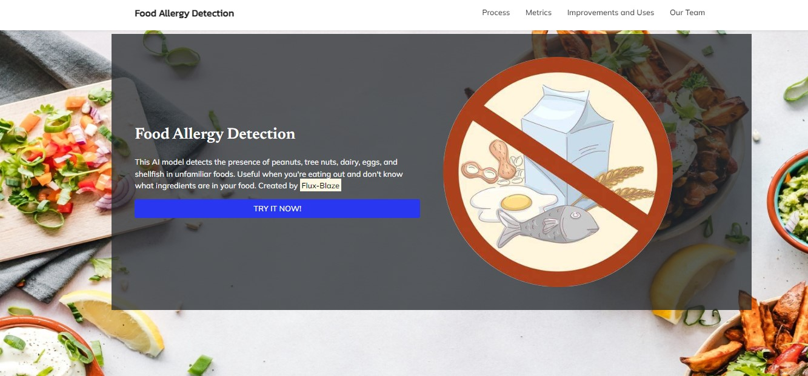

# Food Allergy-Detection

---

### Overview

This project detects possible traces of food that the user is allergic to in the uploaded image of the dish. It detects traces of the 5 most severe allergies: peanuts, tree nuts, eggs, shellfish, and dairy. By doing so, it ensures the safety of the user's health if they have specific allergens they must watch out for in their food. When developing our model, we gathered images of dishes containing severe allergens from [Web Scraping Colab](https://colab.research.google.com/drive/1jUlkGQU7ZyWSPF0fupZ0WaP5eQ04PiCM?usp=sharing) and [Kaggle](https://www.kaggle.com/). After importing the images into [Roboflow](https://roboflow.com), we labeled and developed our data set. Yolov5 was used to train our model, and  [Weights and Biases](https://wandb.ai/home) was used to evaluate the performance of the model. The website for the model was created with Flask using HTML, CSS, and JS. 

### Dataset

  We collected images of various dishes and foods that fit into our categories by web-scraping Google images. We collected images of the 5 most common food allergens; peanuts, tree nuts, eggs, shellfish, and dairy and annotated them in [Roboflow](https://roboflow.com) using both bounding boxes and polygonal annotation to add to diversity and increase out model's accuracy. We then web-scraped Google images for images with no food, just a plausible background, to train our model to know the difference and decrease false positives.

 
In our dataset we ended with about 2000 images in five categories, and an extra category, fish, that we decided to not include in our final model.

 

### Script

1.[Web Scraping Colab](https://colab.research.google.com/drive/1jUlkGQU7ZyWSPF0fupZ0WaP5eQ04PiCM?usp=sharing)

We used this Google Colab notebook to web-scrape Google images to gather data. We did this through Serp API.

2.[Model Training Colab](https://colab.research.google.com/drive/1S6yJRld-k0ttbdJCYVAxhPAET6Ab5eoX?usp=sharing)

We used this Google Colab notebook to train our object detection model. We trained with the YOLOv5 model using our data from [Roboflow](https://roboflow.com) and [Weights and Biases](https://wandb.ai/home) to access the metrics of our model.

### Model Training

The hyperparameters we used in training were:

  

#### Metrics 

We used a confusion matrix, mAP graphs, loss metrics, and a Precision/Recall curve to display our model's performance.

The confusion matrix shows what percent of guesses are shared between True and Predicted. The rows represent instances in the actual class while the columns represent the instances in the predicted class. The squares where the True and Predicted labels match represent correct guesses.

mAP graphs show how mean Average Precision changes over epochs. Precision is True Positive identifications over all positive identifications. Average Precision is the mean precision for varying thresholds for determining if a Positive ID is True Positive. mAP is the average Average Precision for each class. 

The PR curve shows both the precision and recall of our model. Precision is high when the model does not have false positives, and recall is high when the model does not have false negatives. Therefore, an effective model should aim to have both high precision and recall. In this graph, the area under the graph is very large such that our model is effective in detecting the allergens in the dishes.

In the training loss metrics, our model improved as epochs increased in terms of setting up the right bounding box of the allergen, detecting the allergen, and classifying the allergen. Similarly, the model remained consistent in keeping the loss minimal during the validation phase.

## Web Deployment

To deploy our model through a website, we coded a website using Flask(Python framework for HTML, CSS, and JS) in CoCalc. Files used to deploy can be found [here](https://github.com/SelendisErised/Kirby-Detection/tree/main/deploy). To test the deployed web, after installing all the dependencies in requirements.txt (using pip install -r requirements.txt), run the main.py (python3 -m main). Then you should be generated a link, and you can start detecting allergens!

### Future Works And Improvements

In the span of 3 weeks we were able to achieve creating a model that identify's dishes that may have allergens in them and creating a website to allow people to use our model. Even though we finished our model there are still some improvements we can make.

1. Add more images to our current dataset to improve the model's accuracy.
Since our model isn't fully accurate and usually has a confidence around 60%, we plan on adding more images to help the model better familiarize itself with our current allergens.

2. Add more labels to our current model.
Currently we only have Peanuts, Eggs, Dairy, Tree nuts, and Shellfish as our labels. We hope to in the future add more labels including Fish, Soy, Wheat, and other allergens to our model. This will allow our model to identify more allergens than our current ones.

<figure>
  
  </figure>
3. Multi Label current and future images
We plan on multilabeling our current and future images because we know that there are many dishes out there that contains more than one allergen. For example, Pad Thai can contain wheat, fish, shellfish, soy, eggs, and peanuts. So by multilabeling our images the model will be able to identify multiple allergens in one dish.

4. Using the polygon feature
Currently we used the polygon feature that was available on Roboflow, on a few of our images. We plan on using the polygon feature more often, since it can help lessen background positives and negatives.

<figure>

  </figure>

5. Future uses
In the future we hope to be able to convert our model into an app, making it easier and more available for people to use. Another thing that we wish to achieve is for our model to be able to identify and track moving objects.

<figure>
  
  </figure>

# Universal Project Scaffold

A scaffold for deploying dockerized flask applications.

If you have any questions, feel free to open an issue on [Github](https://github.com/organization-x/omni/issues).

### Video Guide

This guide covers how you can quickly deploy most projects with the [Flask](https://flask.palletsprojects.com/) framework and our omni scaffold.

### Quickstart Guide for Local Development

cd into the `/app` folder

`python3 -m pip install -r requirements.txt`

edit line 29 the `main.py` file to either the URL of the cocalc server you are on or `localhost` if you are running it on your own PC

run

 `python3 -m main`

to start the server on local, most changes while developing will be picked up in realtime by the server

### Quickstart Guide for Local Deployment

Make sure docker is installed on your system. Look that up if you don't know what that means.

cd into the root director of the repo then run 

`docker build -t omni .`

once built, run

`docker run -d -p 9000:80 --restart=unless-stopped --name omni omni`

you should then be able to see the `omni` container running when you run 

`docker ps -a`

if it seems to be stuck (i.e. constantly listed as `Restarting`), something is wrong with the docker image or code inside causing it to repeatedly fail.

you can start debugging the project by running 

`docker logs -f omni` 

or

`docker exec -it omni /bin/bash` for an interactive bash terminal (this option only works if the container is running and not stuck in a restart loop)

### Common Issues

`$'\r': command not found` when attempting to start docker container

this is caused by the the `entrypoint.sh` script somehow having CLRF line endings instead of LF line endings.

to fix this run

`sed -i 's/\r$//' entrypoint.sh`

### File Structure

The files/directories which you will need to edit are **bolded**

**DO NOT TOUCH OTHER FILES. THIS MAY RESULT IN YOUR PROJECT BEING UNABLE TO RUN**

- .gitignore
- config.py
- Dockerfile
- READMD.md
- entrypoint.sh
- nginx_host
- host_config
- app/
     - **main.py**
     - **pytorch_model.bin** <- you will need to upload this yourself after cloning the repo when developing the site
     - **requirements.txt**
     - **utils.py**
     - templates/
          - **index.html**

### pytorch_model.bin ###

The weights file - must upload if you are running file on coding center or are trying to deploy.

### main.py ###

Contains the main flask app itself.

### requirements.txt ###

Contains list of packages and modules required to run the flask app. Edit only if you are using additional packages that need to be pip installed in order to run the project.

To generate a requirements.txt file you can run

`pip list --format=freeze > app/requirements.txt`

the requirements.txt file will then be updated. Keep in mind: some packages you install on one operating system may not be available on another. You will have to debug and resolve this yourself if this is the case.

### static/ ###

Contains the static images, CSS, & JS files used by the flask app for the webpage. You will need to create this and put files in it. Place all your images used for your website in static/images/ so that you can then reference them in your html files.

### utils.py ###

Contains common functions used by the flask app. Put things here that are used more than once in the flask app.

### templates/ ###

Contains the HTML pages used for the webpage. Edit these to fit your project. index.html is the demo page.

### Files used for deployment ###

`config.py`
`Dockerfile`
`entrypoint.sh`
`nginx_host`
`host_config`
**Only modify `host_config`. Do not touch the other files.**

# SC22-BatchC-flux-blaze

